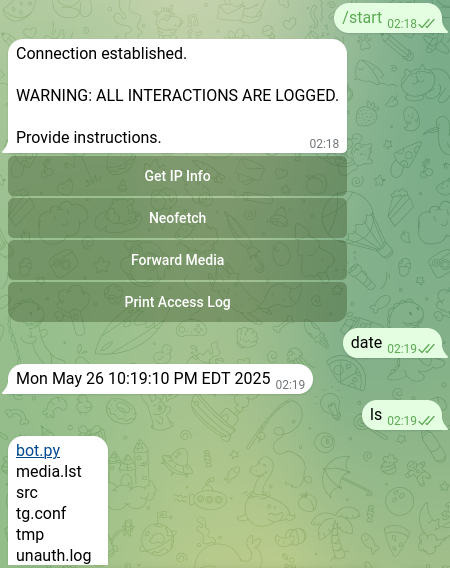

# RATshell-telegrambot
A very simple remote access tool using the `python-telegram-bot` module to execute shell commands.



### - Setup
To run the bot directly (`python bot.py`), you'll need the `python-telegram-bot` module for all platforms:
```
pip install python-telegram-bot
```
Additionally, for Linux:
```
sudo apt install neofetch curl    # these are only necessary for some of the buttons
```

**Remember to add your Telegram user ID and bot token to `tg.conf`!**

  
### - Platforms
This bot has been tested on **Linux**, **Windows 10/11**, and the **Android Termux app.** \
*Note:* On Windows, this bot uses powershell, so all of it's aliases will work (ls, cp, mv, pwd).

  \
**`lightweight-bot.py`**: This is a much smaller bot that has no buttons, does not archive media, but still maintains an access log and supports the 3 platforms listed above. \
So pretty much just executing messages as shell commands and non-admin access logging.

  \
***Optional:*** \
Reccomended command list to send to [BotFather](https://t.me/botfather):
```
start - open start menu
v - view archived media
r - remove next media
x - enter shell 
q - exit shell
```
