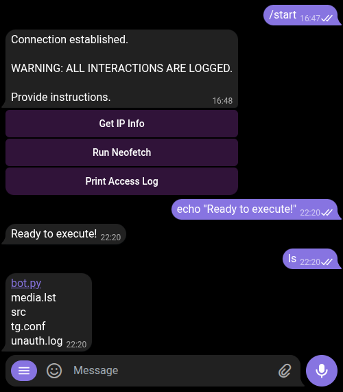

# RATshell-telegrambot
A simple remote access tool using the `python-telegram-bot` module to execute shell commands. \
It can also send files to the user with `/get` and stores any file sent to it. 
With files that exceed the bot download limit (~20MB), it saves the file ID so they can still be retrieved with `/get`



### - Setup
To run the bot, you'll need the `python-telegram-bot` module for all platforms:
```
pip install python-telegram-bot
# OR:
sudo apt install python3-python-telegram-bot
```
Additionally, for Linux:
```
sudo apt install neofetch curl    # these are only necessary for some of the buttons
```
Clone the repo and add your Telegram ID and bot token to `tg.conf`:
```
git clone https://github.com/yeeter727/RATshell-telegrambot
cd RATshell-telegrambot
echo "change info in tg.conf"
```
Run the bot:
```
python bot.py
```

  
### - Platforms
This bot has been tested on **Linux**, **Windows 10/11**, and the **Android Termux app.** \
*Note:* On Windows, this bot uses powershell, so all of it's aliases will work (ls, cp, mv, pwd).

  \
**`shellonly-bot.py`**: This is a much smaller bot that has no buttons, does not save files, but still maintains an access log and has been tested on the 3 platforms listed above. \
So it's just the shell and unauthorized access logging.

  \
***Optional:*** \
Reccomended command list to send to [BotFather](https://t.me/botfather):
```
start - open start menu
get - /get <file_or_dir_path> • /get -t <file_type>
manage - open file management menu
remove - delete selected files
```
